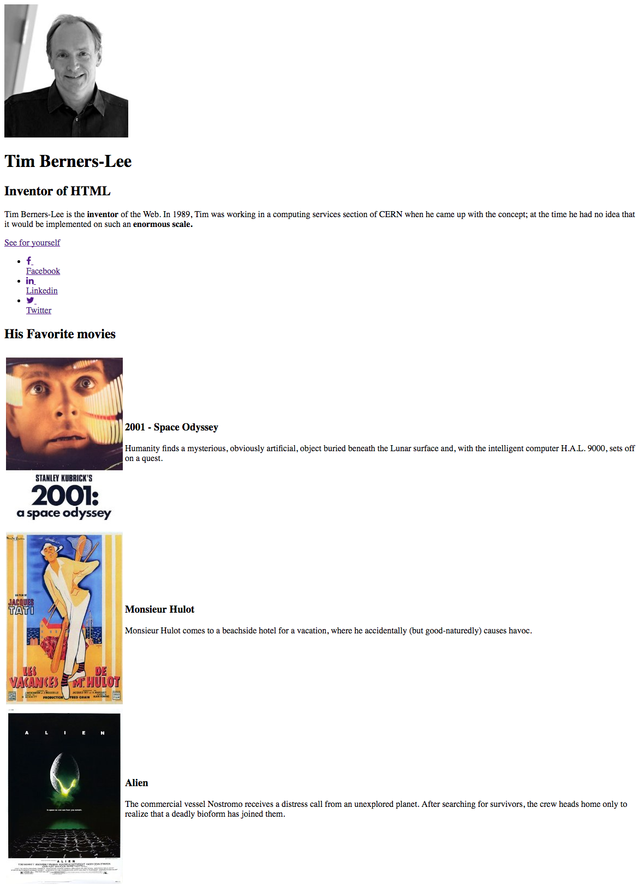

# Introductie

## Vaardigheden

- Begrip
- Autonomie
- Organisatie
- Uitvoering
- Presentatie

## Doelen

- Maak een pagina over Tim Berner Lee
- Begrijp de principes van HTML en CSS
- Presenteer uw pagina en code

## Briefing

### Stap 1: Git

- Maak een repo op GitHub genaamd **starting-web-development**
- Clone de repo op uw lokale machine

### Stap 2: HTML

Pas de volgende praktische stappen toe op de map **"starting-web-development"**

- Maak een bestand **index.html**
- Maak een bestand **style.css**
- Maak een folder **images**
- Download deze afbeelding in de folder **images** : 
- Download deze afbeelding in de folder **images** : 
- Download deze afbeelding in de folder **images** : 
- Download deze afbeelding in de folder **images** : 

- In **index.html** Schrijf HTML code zodat je exact de volgende afbeeldingen krijgt 
  - Link naar Tim Berners-Lee's Wikipedia : https://fr.wikipedia.org/wiki/Tim_Berners-Lee
  - Voor icons gebruik je dit :
  
```html
  <link rel="stylesheet" href="https://use.fontawesome.com/releases/v5.5.0/css/all.css" integrity="sha384-B4dIYHKNBt8Bc12p+WXckhzcICo0wtJAoU8YZTY5qE0Id1GSseTk6S+L3BlXeVIU" crossorigin="anonymous">
```
  - Voor te zoeken naar Icons ga je naar [FontAwesome](http://fontawesome.io/icons/)

### Stap 3: CSS

- Zorg dat je pagina er als volgt uit ziet 
- Voor een mooi font gebruik je :

```html
<link rel="stylesheet" href="http://fonts.googleapis.com/css?family=Open+Sans:400,300,700|Montserrat:400,700">
```
- Om te weten hoe je dit toepast, ga naar [Google Font](https://fonts.google.com/?query=open&selection.family=Montserrat|Open+Sans)
- Voeg verschillende `div`s 'toe in HTML om de elementen als blokken te scheiden
- In **style.css**
  - Herpositioneer de `div`s
  - Centreer de `div`s
  - Vul de achtergrond van de `div`s
  - Verander de kleur van het font
  - Lijn de tekst uit

### Stap 4: Save with Git

- Doe een `Add`
- Gevolgd door `commit`
- Dan een `push`
- Ga op uw GitHub-profiel om de wijzigingen te controleren

### Stap 5: Presentatie

- Presenteer uw code
- Leg de drempels / moeilijkheden uit
