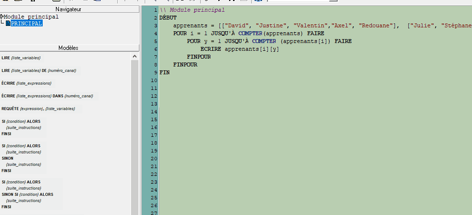

# Functies

1. [Inleiding](../README.md)
1. [Variabelen](./variables.md)
1. [Condities](./conditions.md)
1. [Lussen](./whileAndFor.md)  
1. [Arrays](./array.md)
1. Functies ←
    * [Vooraf gedefinieerde functies](#vooraf-gedefinieerde-functies)
    * [Eigen gemaakte functies](#eigen-gemaakte-functies)

Functies zijn "code snippets" die een opeenvolging van instructies, loops, condities, etc..... bevatten. 
Deze functies worden gebruikt door het als volgt te schrijven: ``FUNCTION()``. 

## Vooraf gedefinieerde functies

Er zijn al kant-en-klare functies binnen LARP. 
Een van deze functies had u kunnen helpen met de vorige opdracht. 
Bijvoorbeeld, de ``MAX()`` functie analyseert de tabel en geeft het hoogste aantal terug. 

````
START
    numbers = [2,98,-5,48,55]
    WRITE MAX(numbers)
END
```` 
Deze code geeft het nummer 98 terug. Er is de tegenovergestelde functie die het kleinste getal oplevert. 

````
START
    numbers = [2,98,-5,48,55]
    WRITE MIN(numbers)
END
```` 
Geeft als resultaat het getal -5. 

Een andere functie die zeer nuttig is, is de functie ``COUNT()``. 
Deze functie geeft het aantal elementen in de array weer. 

Voorbeeld:
````
START
    juniors = ["David", "Justine", "Valentin","Axel", "Redouane"]
    WRITE COUNT(juniors)
END

````
Geeft als resultaat 5 terug. 
Deze functie zou nuttig zijn geweest voor de lussen van het vorige hoofdstuk. 

````
\\ Main module
START
    juniors = [["David", "Justine", "Valentin","Axel", "Redouane"],  ["Julie", "Stéphane", "Mostapha", "Claudiu", "Son"]]
    FOR i = 1 TO COUNT(juniors) DO
        FOR y = 1 TO COUNT(juniors[i]) DO
            WRITE juniors[i][y] 
        ENDFOR 
    ENDFOR
END   
````

Herinnert u zich dat nog? In het voorbeeld in het vorige hoofdstuk moesten we het aantal juniors in de lus zetten. 

````
\\ Main module
START
    juniors = [["David", "Justine", "Valentin","Axel", "Redouane"], ["Julie", "Stéphane", "Mostapha", "Claudiu", "Son"]]
  
    FOR i = 1 TO **2** DO
        FOR y = 1 TO **5** DO
            WRITE juniors[i][y] 
        ENDFOR 
    ENDFOR
END  
````
Het was niet erg praktisch, stel je voor dat één van de twee arrays 4 juniors had en de andere 5 juniors. 
Er zou een LARP-fout zijn gemaakt omdat hij de 5e leerling niet zou hebben gevonden.  

Probeer deze code, hier hebben we "Julie" uit de Lovelace-startup verwijderd. 
U krijgt een compilatiefout.

````
\\ Main module
START
    juniors = [["David", "Justine", "Valentin","Axel", "Redouane"], ["Stéphane", "Mostapha", "Claudiu", "Son"]]
  
    FOR i = 1 TO 2 DO
        FOR y = 1 TO 5 DO
            WRITE juniors[i][y] 
        ENDFOR 
    ENDFOR
END  
````

De functie ``COUNT()`` lost dit probleem op. 
Een beetje extra info, als we de variabele "juniors" tussen de haakjes ``COUNT(juniors)`` zetten, zeggen we dat we de variabele als **parameter** doorgeven. 


## Eigen gemaakte functies 

Het is mogelijk om uw eigen functies te creëren. Voor het voorbeeld zullen we een "ADD" functie creëren die de som van de twee variabelen die in argmuent worden doorgegeven, teruggeven. 

Ga eerst naar het linker venster en klik met de rechtermuisknop op ``MAIN``, kies dan ``New pseudo code module`` en noem hem ``ADD``.



In de nieuwe module geven we aan dat we 2 parameters kunnen ontvangen. 
````
\\ Auxiliary module ADD
ENTER a, b
````
Dit betekent dat twee argumenten kunnen worden doorgegeven door ``ADD(a,b)`` te schrijven.
Dan moeten we hem vertellen dat de ``sum`` variabele de waarde van a + b is. 

````
\\ Auxiliary module ADD
ENTER  a, b
    sum = a + b
````

Tot slot moeten we definiëren wat de functie zal teruggeven, in dit geval de uitkomst van de optelling. 
````
\\ Auxiliary module ADD
ENTER  a, b
    sum = a + b
RETURN sum
````

U kunt nu terugkeren naar de hoofdmodule.
Roep uw functie aan door ``ADD(4,8)`` te schrijven.
(Of een willekeurig getal) 

````
\\ Main module
START
   WRITE ADD(5,6)
END 
```` 
Het resultaat zal 11 zijn.  
Goed bezig!, je hebt net je eerste functie gemaakt. 
Laten we beginnen met de oefeningen. 

## Oefeningen 
1. Creëer een ``HELLO()`` functie die als parameter (FIRST_NAME) aanneemt en een zin "Hallo en welkom FIRST_NAME" retourneert
1. Creëer een functie met 2 parameters (A en B). Deze functie geeft ``0``` terug als A groter is dan B en ``1`` als B groter is dan A
1. Creëer een functie met drie parameters (FIRST_NAAM, SKILL, STARTUP). De SKILL-variabele is een array die alle vaardigheden van de junioren bevat. Deze functie geeft de volgende zin terug: "FIRST_NAME is van de startup STARTUP en kent SKILL 1, SKILL 2 enz. 

1. **De juiste prijs, level 2.** Maak in de hoofdmodule een PRIJS-variabele aan die een willekeurige waarde heeft. (U moet kijken in de documentatie naar de beschikbare functies in LARP.) Het programma zal de gebruiker vragen om de prijs in te voeren om te raden. Creëer een functie die controleert of de prijs correct is of niet. Als de te raden prijs lager is dan de ingevoerde prijs, wordt "It's less" weergegeven. Als de prijs hoger is dan de gecodeerde prijs, "It's more". Als de prijs gewoon "Bravo, je hebt gewonnen" is. Opgelet, de gebruiker is beperkt tot 10 voorstellen. Als het de 10 voorstellen overstijgt, verschijnt er "You lost!
1. JEDI LEVEL! Maak een algoritme aan die de volgende array automatisch sorteert   
   ``tri = [454, 4, 59, 68, 1, 0, -1 , 56 , 7 , 9]`` 
Gebruik ALLES dat je in deze korte briefing hebt geleerd.


Al klaar ?
Goed gedaan, je kunt trots zijn op jezelf, je hebt net de basis van alle programmeertalen geleerd. 


**Ga terug**: [Overzicht](../../)