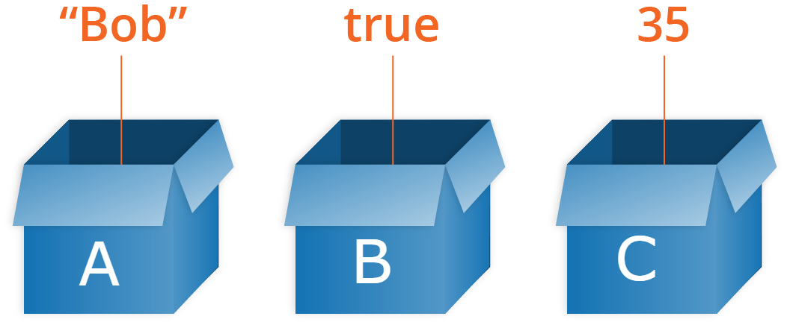
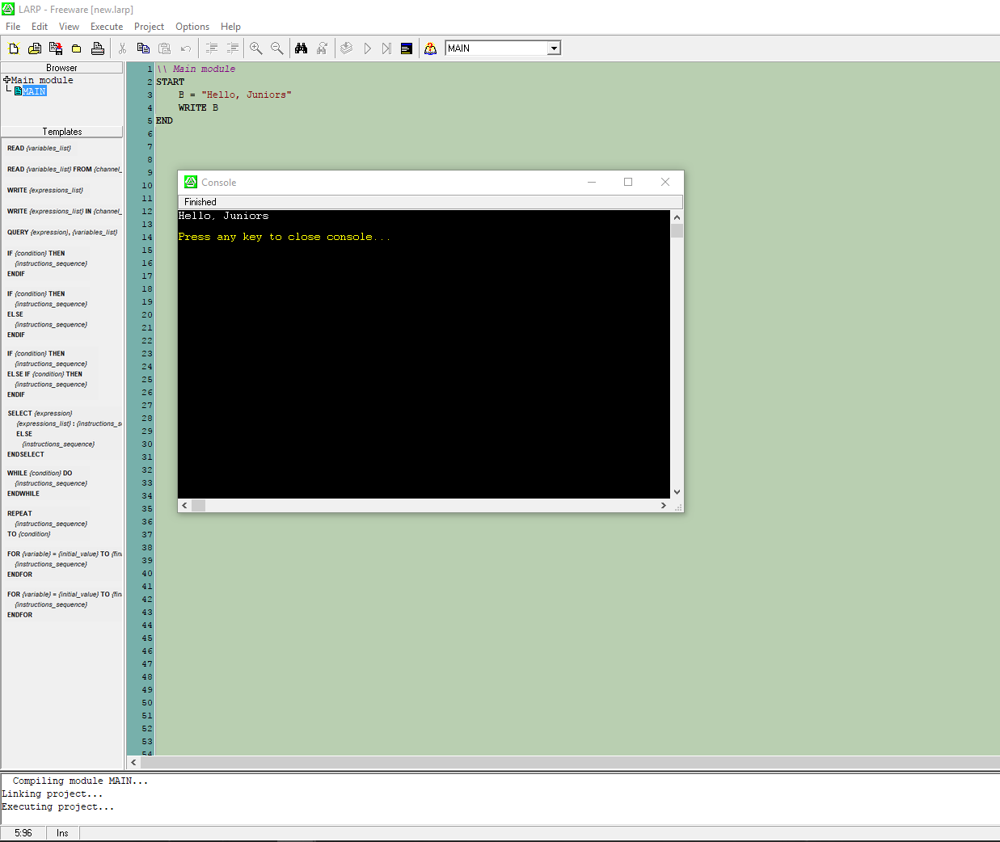

# Variabelen

1. [Inleiding](../README.md)
1. Variabelen ←
    * [Declareren van variabelen](#declareren-van-variabelen)
    * [Operatoren](#operatoren)
    * [Lezen en schrijven van variabelen](#lezen-en-schrijven-van-variabelen)
1. [Condities](./conditions.md)
1. [Lussen](./whileAndfor.md)
1. [Arrays](./array.md)
1. [Functies](./function.md)


Met de variabelen kunt u **tijdelijk** een **waarde** in het geheugen van de computer opslaan. Het kan dan gebruikt en gebruikt worden in een programma wanneer de tijd daarvoor rijp is. Dit is te vergelijken met een klein doosje waarin men informatie of meerdere stukken informatie kan opslaan. 

Er zijn verschillende soorten variabelen, waarvan sommige hele getallen, andere kommagetallen of een reeks karakters kunnen bevatten. Een ander type dat zeer praktisch is, is Booleaans. Een booleaanse variabele kan slechts 2 waarden bevatten, ofwel "False" of "True".  Er zijn andere soorten, maar daar zullen we later meer over zien.




## Declareren van variabelen
De naam van de variabele is hier A en de waarde ervan is een integer (2).
````
\\ Main module
START
    A = 2
END
````

De naam van de variabele is A en deze keer bevat de variabele een tekenreeks die ook wel String wordt genoemd. Strings beginnen altijd met aanhalingstekens.
````
\\ Main module
START
    A = "This is a string of characters"
END
````

**Wees dus voorzichtig, in het volgende voorbeeld is het geen geheel getal maar een string.**
````
\\ Main module
START
    A = "2"
END
````

## Operatoren
Operators laten u toe om te delen, te vermenigvuldigen, optellen, etc.... 

De variabelen kunnen bijvoorbeeld bij elkaar opgeteld worden, maar ze moeten van hetzelfde datatype zijn.
````
\\ Main module
START
    A = 4
    B = 6
    A + B // will return 10
END
````
Het is echter niet mogelijk om een string en een geheel getal toe te voegen. Dit zou een fout veroorzaken.
````
\\ Main module
START
    A = "Hello"
    B = 4 
    A + B // will return an error because the compiler does not understand what it should add
END
````
 
Anderzijds kunnen twee tekenreeksen worden samengevoegd

````
\\ Main module
START
    A = "Hello, juniors"
    B = "from hopper"

    A + B \\\ Will return "Hello, juniorsfrom hopper"
END
````

De samengevoeging zal de twee geplakte strings teruggeven. Om een ruimte tussen de twee strings te plaatsen, kunnen we dit doen: 

````
\\ Main module
START
    A + " " + B \\ Will return "Hello, juniors from hopper"
END
````
Merk op dat dit ook wel "concatineren" wordt genoemd.


## Lezen en schrijven van variabelen
Tot nu toe geven we de variabelen die we in de console gebruiken niet weer, dus voor nu zijn onze variabelen nutteloos.  
We zullen het probleem oplossen door gebruik te maken van een functie waarmee we de variabelen naar de console kunnen schrijven.  
````
\\ Main module
START
    B = "Hello, Juniors"
    WRITE B
END
````
Druk op ``F7`` of de kleine ``Run`` knop (kleine afspeelknop) in LARP. Je zou zoiets moeten zien: 




Met de ``READ`` functie is het mogelijk om vast te leggen wat de gebruiker in de console invoert. Probeer dit eens: 

````
\\ Main module
START
    A = "What's your first name?"

    WRITE A
    READ RESPONSE

    B = "Hello "
    WRITE B + RESPONSE  
END
````

Ga je gang en speel er wat mee.

## Oefeningen


### 1. Wat zal dit resultaat opleveren?
````
\\ Main module
START
    A = "8"
    B = "7"
    WRITE A + B
END
````
<details>
    <summary>Oplossing</summary>
    "87"
</details>

### 2. En dit?
````
\\ Main module
START
    A = 8
    B = "7"
    WRITE A + B
END
````
<details>
    <summary>Oplossing</summary>
 
Het antwoord is **15**  
In een dergelijk geval begrijpt de compiler dat hij ``B`` moet interpreteren als een geheel getal. Dit gezegd zijnde, vermijden we dit soort dingen absoluut. Aan de ene kant zal het niet in alle talen werken en aan de andere kant kan het tot verwarring en fouten of onverwachte resultaten leiden.
</details>


### 3. Maak een zin met de volgende woorden

````
\\ Main module
START
    A = "learning"
    B = "am"
    C = "i"
    D = "code"
END
````

<details>
    <summary>Oplossing</summary>

````
\\ Main module
START
    A = "learning"
    B = "am"
    C = "i"
    D = "code"

    WRITE C + " " + B + " " + A + " " + D
END
````
</details>

### 4 . Keert de waarden van twee variabelen om
```
\\ Main module
START
    A = 7
    B = 12 
END
```

<details> 
  <summary>Oplossing</summary>

```
\\ Main module
START
    A = "7"
    B = "12"
    
    \\ We need to create a variable C that will contain one of the values
    C = A
    
    A = "A equals " + B
    B = "B equals " + C 
    WRITE A
    WRITE B
END
``` 
</details>

<details> 
  <summary>Alternative oplossing</summary>

```
\\ Main module
START
    A = 7
    B = 12 
        
    \\ Without creating any additional variables
    A = A - B
    B = A + B 
    A = B - A           
END
``` 
</details>

### 5. Stel 2 vragen aan de gebruiker van uw programma. U moet zijn voornaam vragen die u in een variabele "FIRST_NAME" moet opslaan en zijn favoriete gerecht in de variabele "FAVORITE_FOOD". Schrijf dan een zin met deze informatie die er als volgt uitziet: "Je voornaam is..... en je favoriete gerecht is......

<details>
    <summary>Oplossing</summary>

````
\\ Main module
START
    WRITE "What's your first name?"
    READ FIRST_NAME
    WRITE "What's your favorite dish?"
    READ FAVORITE_FOOD   
    WRITE "Your first name is" + FIRST_NAME + " and you like " + FAVORITE_FOOD
END
````
</details>    

&nbsp; 
    
**Volgende hoofdstuk**: [Condities](./conditions.md)  
