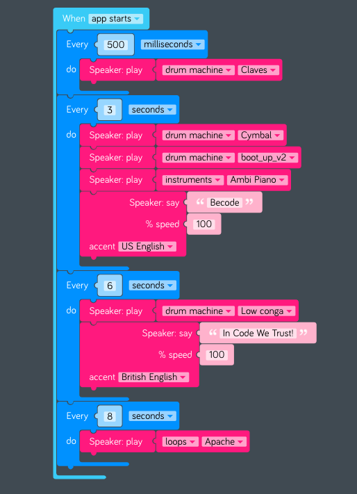

# Interactive music

## Objectives
- train your logic muscles
- think in term of logical structures (loops, variables, functions, conditions)
- learn a tool that can help you give the taste of coding to kids and teenagers...

## Goal
Program a music track ! [Example](https://apps-staging.kano.me/remix/ode-to-becode)

## steps
1. First, based on the screenshot of the code below, try to read the track I did, and reverse-engineer it. 
2. Then, try to identify logical structures : loops, variables, functions.

1. Then, follow the [training tutorials](https://world.kano.me/coding-challenges/training)
2. When ready, create a soundtrack using only the possibilities given by the interface
3. How about making it interactive ?
3. Finished? Post your track on Ryver so we can all enjoy it :-)
 