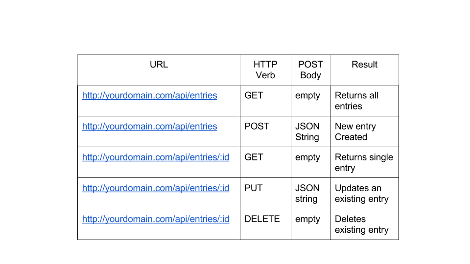

# Quotes API with ExpressJS and MongoDB

- Repository: `becode-quotes-api`
- Duration: 3 days
- Deadline: 22/02/19 23:59 PM
- Delivery style: 
	- API hosted on heroku + mongoDB database
- Team mode: yes
	- backend: 2 developers
	
## Doelstellingen

- Begrijpen wat een RESTfull API is
- CRUD acties met MongoDB
- Creëer een eigen RESTfull API met Express en MongoDB
- Host eigen API op Heroku

## Wat is CRUD

[CRUD](https://developer.mozilla.org/en-US/docs/Glossary/CRUD) staat voor **C**reate **R**ead **U**pdate **D**elete. Het is een afkorting voor de 4 belangrijkste acties om met gegevens in een database te werken. 

### REST

Met expressJS kunnen we op een NodeJS server een eigen API ontwikkelen. Wanneer we een API ontwikkelen doen we dit volgens het [RESTfull](https://restfulapi.net/) principe.

Eén bepaalde resource uit onze database, bijvoorbeel *users*, zal voorgesteld worden door een URI.

```
website.com/api/users
```

Wanneer we vervolgens een *request* doen naar dit API endpoint zal dit resulteren in een actie in de database. 

- Een **GET** request naar deze URI zal een lijst van alle users teruggeven
- een **POST** request naar deze URI zal een nieuwe user creëren

Een goed ontwikkeld REST API bestaat uit duidelijke URI's. Hiervoor is het belangrijk dat de resources een duidelijke [naamgeving](https://restfulapi.net/resource-naming/) hebben.



### MongoDB

MongoDB is een veel gebruikte database met ExpressJS. Om de gegevens in deze database te bewerken kan je ook gebruik maken van [CRUD operaties](https://docs.mongodb.com/manual/crud/).

## To Do

Creëer een RESTfull API voor een 'quotes' resource:

- Ontwikkel alle nodige routes voor je resource
	* Een *GET* 	`/quotes` route die een lijst met alle quotes geeft
	* Een *POST* 	`/quotes` route waarmee een quote kan toegevoegd worden
	* Een *GET* 	`/quotes/{{quoteId}}` route die een specifieke quote geeft
	* Een *PUT* 	`/quotes/{{quoteId}}` route die een specifieke quote updatet
	* Een *DELETE* 	`/quotes/{{quoteId}}` route die een specifieke quote verwijdert

- Upload je API naar Heroku
- Maak een duidelijke README met
	* Gebruikte technologieën
	* Endpoints van je API

## Bonus

Maak een nieuw repository aan om je API te gebruiken. Ontwikkel een pagina waar je quotes op worden weergegeven en quotes toegevoegd kunnen worden. Host deze pagina op github pages.

## Get to work


